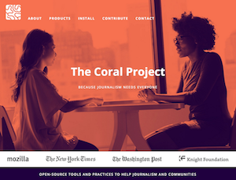

# Welcome to the Coral Project documentation! 

This site aims to familiarize you with the Coral Project, how it works, and how you can help.

 

### What is the Coral Project?

The Coral Project is an open source project to help publishers of all sizes build better communities around their journalism. We're creating tools that allow everyone feel safe, respected, and heard. It consists of three products: [Ask](#ask), [Trust](#trust) and [Talk](#talk). 

Sign up for the [Coral Project newsletter](https://tinyletter.com/coralproject/subscribe/) to stay tuned for announcements, software updates and the latest news on community engagement.

If you'd like to learn more about the Coral Project from a high-level perspective, please visit our [ Coral Project website](https://www.coralproject.net). You can find information there about the project, our goals, and our products.

### Who Can Benefit?

We’ve designed our products to meet essential needs of journalism through effective online communities.

**Publishers**

* Increase engagement, loyalty and user satisfaction

**Editors**

* Custom comment moderation dashboards, find great contributors and reduce spam submissions

**Journalists**

* Find potential story sources, high quality interactions and curate audience engagement

**Community Members**

* Control your commenting experience, interact with journalists and avoid harassment

### Guides
Strong community is about more than software. Our guides will help everyone in the newsroom be intentional about their community choices, whatever technology you use. We are currently covering these issues on our [blog](https://coralproject.net); the complete guides will be released in Q1 2017.

### How can I contribute?

We want your ideas, your requests, your experiences, your bug reports, your skills, your code. [Join our community of contributors](contribute).

### Learn more

For more information about us and to see our blog, please visit [our website](https://coralproject.net) and [sign up to our newsletter](http://tinyletter.com/coralproject). We are also on [Twitter](https://twitter.com/coralproject).

_The Coral Project is a collaboration between [The Mozilla Foundation](https://www.mozilla.org/en-US/foundation/), [The New York Times](http://nytimes.com), and [The Washington Post](http://washingtonpost.com), and is funded by a grant from [The John S. and James L. Knight Foundation](http://knightfoundation.org)._
