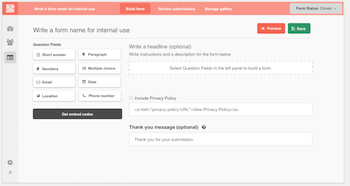

# Ask

_Updated: 11/2/2016_

### Latest Release 0.0.7

- [Download the latest release](https://github.com/coralproject/ask-install/releases) of the ask-installer for your os from our Github repository

- If you have questions about installing Ask, please email [jeff@mozillafoundation.org](jeff@mozillafoundation.org).

## What is Ask?

Ask is a tool that enables editors to create embeddable calls for contributions, including text, photo, video, and audio. The contributions can be connected to existing user profiles. Editors can manage high volumes of contributions, and display the best ones alongside the call. 

### Who is Ask for?

* **Engagement editors and journalists**: People who invite, manage, and publish user-generated content in order to improve the quality of the journalism.
* **End users**: People who consume content and contribute their own knowledge and experiences, in order to improve the quality of the coverage so that it is closer to their own needs and experiences.
* **Publishers**: People who want to understand the value of engaging more deeply with segments of the users, in order to better assess how and why to invest smartly in community.

We've created a guide on how to write a well-considered form. [You can read it here](https://blog.coralproject.net/forms-audience-engagement/).



## Ask Installation ##

### 1. Deploy AWS EC2 Server

### 2. Set up S3 bucket and IAM permissions

### 3. Add Server DNS for SSL certificate

### 4. Ask Environment Configuration

### 5. Run Ask Install


## Before You Get Started

### Where will you be hosting Ask?

Ask can be installed on a local machine or a server. Local installs are generally for evaluation or development purposes. 

Server installs are no different than local installs except they are on a server that is accessible by others. Before starting, you will need to provision a server and get access to it via ssh.  Server installs can use ssl to allow secure https connections but dns needs to be installed first.

The web url will generally look like this: `http://localhost:2020`

You may pick any free port you like. If you’re not sure which ports are free, use :2020 as this is rarely taken. Local installs do not support ssl over https.

##Requirements

### Operating System

- Any [version of Linux supported by Docker](https://docs.docker.com/engine/installation/linux/)
- MacOS Yosemite 10.10.3 or above 
- Ask can run on any Linux Docker container service. Cloud options include AWS, Azure and similar cloud hosting providers
- _Microsoft Windows is not supported at this time_
- _Windows Server Containers 2016 untested_


### Docker 
Docker 1.12.1 or later is required. 

Visit the Docker website for [stable releases](https://www.docker.com/products/docker). Please make sure that the docker install is a stable release as we have encountered problems with experimental Docker releases.

## Step By Step Install

### Launch A new Amazon AWS Instance via EC2 Dashboard

  1. Select AMI Image
    - Ubuntu Server 16.04 LTS (HVM), SSD Volume Type 64-bit - ami-6e165d0e
Ubuntu Server 16.04 LTS (HVM),EBS General Purpose (SSD) Volume Type. Support available from Canonical (http://www.ubuntu.com/cloud/services).

  2. Select Instance Type and then click 'Next'
    - t2.medium
    
  3. Configure Instance Details and then click 'Next'
    - **Number of Instances:** 1
    - **Network, Subnet and Auto-Assign Public IP:** Ensure the EC2 instance is placed into a VPC network and subnet that match your desired demo/testing/production goals
    - **IAM Role:** None
    - **Leave these items as defaults (Optional)**
      - Shutdown behaviour
      - Enable termination protection
      - Monitoring
      - Monitoring
      
  4. Add storage:
    - Enter '8GB' and then click 'Next'
  
  5. Tag Instance (Optional) 

  6. Configure Security Group
    - You can use an existing security group or create a new one in AWS's VPC
    - We recoommend you define access for the following ports:
        
    ``` 
    Type  Protocol  Port  Source    IP
    SSH   TCP     22    MY IP   YOUR-IP-ADDRESS (example 64.28.114.31/32)
    HTTPS TCP     443   ANYWHERE  0.0.0.0/0
    HTTP  TCP     80    ANYWHERE  0.0.0.0/0
    ```
    
    - We recommend you limit remote access via ```ssh/22``` to only the necessary IP's of your office connection which can be found using sites like [https://whatismyipaddress.com/](https://whatismyipaddress.com/)
    - If you use a VPN, you can find out what range is covered and enter that in

  7. Review EC2 Instance Settings
  8. Create new key pair or use existing one


## FAQ

- We have encountered errors when installing into symlinked folders. 

## HTTPS and Spam Reduction

### Will you be hosting Ask over https?


What is https?


If you’re ok with http or you’re installing a local machine (as opposed to a server that’s accessible by others), you may proceed to the next question.


If you want to use https, you will need to go to your DNS provider and set up the domain to point to your new server before you run the install script.  


This is required because Ask contains an automated mechanism for acquiring a secure certification (https://github.com/mholt/caddy) and keeping it up to date. The server must be reachable using the `https://your.domain.com` in order for this to happen.


### Do you want reCAPTCHA enabled?


Ask Forms can be protected from bots submitting false entries via reCAPTCHA.  You can learn more about it here: [https://www.google.com/recaptcha/intro/index.html](https://www.google.com/recaptcha/intro/index.html).


If you want to use reCAPTCHA, you need to have signed up for an account and have the keys ready as they will be needed during the Ask install process.


Will you be publishing forms to S3?

## Hosting

### What is AWS S3?


Ask publishes forms and gallery embeds to static files. This improves load times, allows for greater scale and availability. If you don’t expect many thousands of forms requests per day, it is probably best to not use S3. By default Ask will publish files to and serve them from the same server it runs on.


If you want to publish to S3, please create a bucket for Ask and have the following pieces of info at hand during the installation:


- S3 bucket name
- S3 public key
- S3 secret key

_For very large international projects, consider fronting your S3 bucket with a CDN such as [Amazon CloudFront] (https://aws.amazon.com/cloudfront/) or [Cloud Flare] (https://www.cloudflare.com/)._


If you’d like to use another platform to host your files, let us know! 

We can work together to build it as an option into the Coral Platform!

