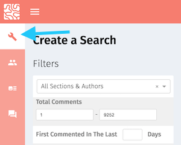
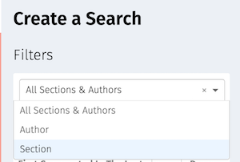
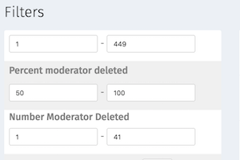
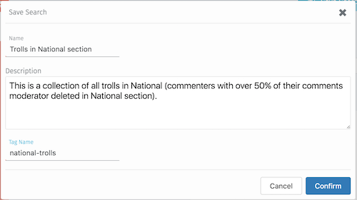

# Trust tutorials

This is where you can find tutorials on how to best utilize the Trust product.

Do you have a tutorial you'd like to see here? Please [get in touch and let us know about it](../contribute/supporting_the_community), or better still, [add it yourself!](../contribute/writing_documentation)

## What would you like to do?

* [Identify the most liked comments](#identify-most-liked-comments-tutorial): I would like to find the most liked comments based on keyword/topic searches, so that I can do a round up (for instance, "best comments written about the Zika virus”).
* [Identify high quality comments](#identify-high-quality-comments-tutorial): I would like to identify commenters who leave high-quality comments that appear to be expert, so that potential sources can be identified.
* [Identify high quality new commenters](#identify-high-quality-new-commenters-tutorial): I would like to identify new commenters who leave comments that get a lot of likes, so I can welcome them personally.
* [Identify trolls](#identify-trolls): I would like to identify trolls on certain topics or authors, so that their comments on these subjects can automatically be moved to pre-moderation/create notifications for moderators to pay attention.

## Identify most liked comments

Specifically, we'd like to identify the most liked comments based on keyword/topic searches, so that we can do a round up (for instance, "best comments written about the Zika virus”).

## Identify high quality new commenters

We would like to identify new commenters who leave comments that get a lot of likes, so we can welcome them personally.

## Identify trolls

We would like to identify trolls on certain topics or authors, so that their comments on these subjects can automatically be moved to pre-moderation/create notifications for moderators to pay attention.

What are some ways that can we identify trolls?

* A user with a high percentage of moderator deleted comments.

What might we be able to do about users like this?

* It's possible that a user may not exhibit troll behavior in all sections or for all authors. We can identify the sections in which they havea  high percentage of moderator deleted comments and ban them only for those sections/authors, so that they can continue to contribute to the community elsewhere.
* We can automatically move that user's comments into pre-moderation.

### How to identify trolls on certain topics or authors

We are going to create and save a list of commenters who have a high percentage of moderated deleted comments for a particular section or author. For the purposes of this tutorial, we'll assume we are looking for trolls in the "National" section.

1) Open the "Create a Search" page by clicking the wrench symbol on the side navigation bar.

2) In the "Filters" section, choose "Section" in the drop down. This will trigger the display of a second drop down, which will let you choose which section you want to filter in (in this case, the "national" section).

 

3) Scroll down to the "Percent moderator deleted" filter.

4) Fill in "50" and "100": you're now filtering out all of the users in the "National" section who have had 50% or more of their comments moderator deleted.

5) You now have a filter that shows you all of the users who have had over 50% of their comments in the National section deleted by moderators. You can now save that search to refer back to later, or to allow your colleagues to have access to the search as well.

Click the "Save Search" button in the upper right to save.

6) You can now fill in the name of the search and a brief description. The "tag" field will create a tag that will attach itself to each user in the "Trolls in National section" list.

Click "Confirm" to save your search.

7) You (and your colleagues) can now access this saved search via the "Saved Search" button in the side navigation bar.

